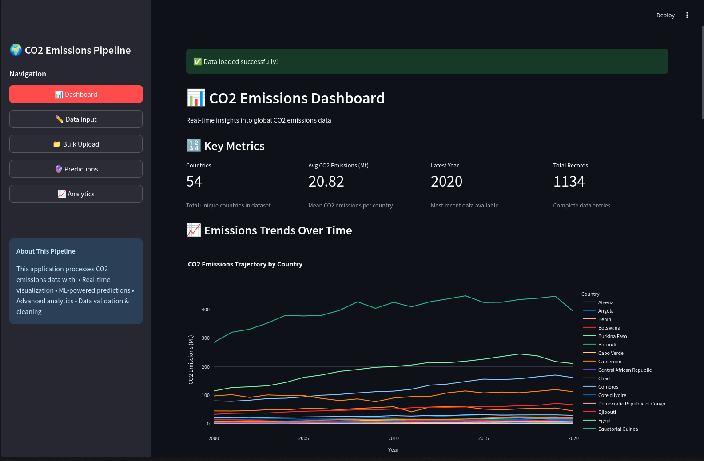

# CO2 Emissions Dashboard



## About the Project

This dashboard provides an interactive visualization of CO2 emissions data. The application allows users to explore emission trends over time, compare emissions across different regions, and analyze the factors contributing to carbon footprint variations.

## Live Demo

You can access the live application here: [co2-emmissions.streamlit.app](https://co2-emmissions.streamlit.app)

## Running Locally

To run the application on your local machine, follow these steps:

### Using Poetry

```bash
# Install dependencies
poetry install

# Activate the virtual environment and run the app
poetry run streamlit run app.py
```

### Using traditional virtual environment

```bash
# Create and sync dependencies
uv sync
source .venv/bin/activate
streamlit run app.py
```